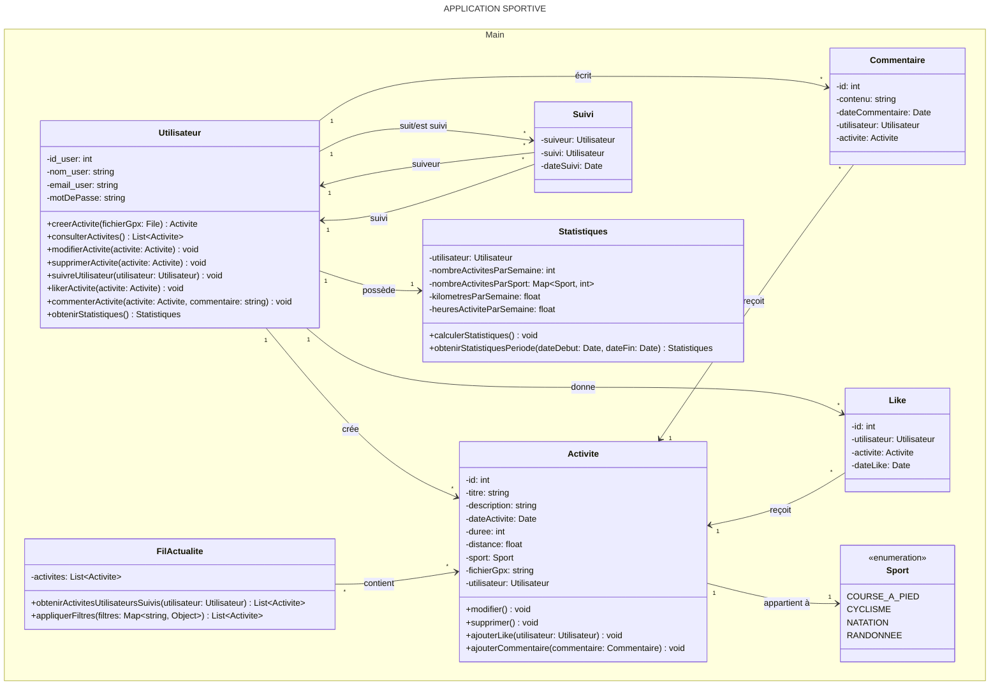

<!-- code à excécuter sur https://mermaid.js.org/syntax/classDiagram.html#syntax -->
<!--  pour mettre un commentaire dans un fichier .md-->
<!-- installer extension Markdown Preview Mermaid Support pour prévisualisation sur Vscode -->

