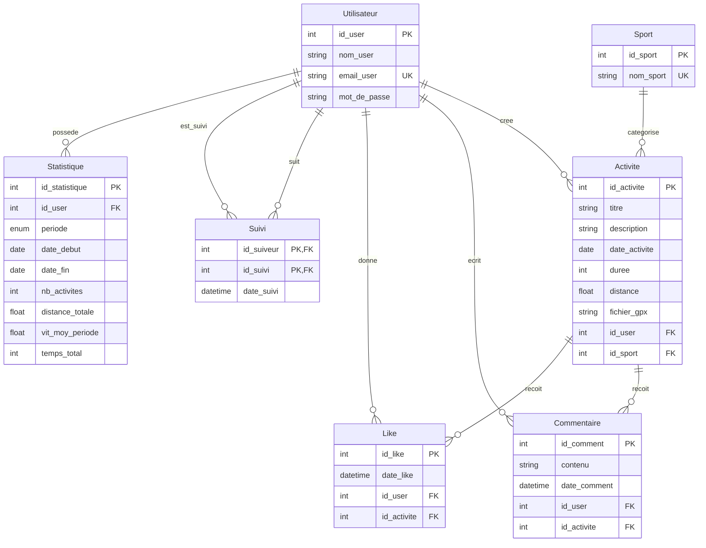

```mermaid
erDiagram
    %% Table principale des utilisateurs
    Utilisateur {
        int id_user PK
        string nom_user
        string email_user UK
        string mot_de_passe
    }
    
    %% Table des sports (référentiel)
    Sport {
        int id_sport PK
        string nom_sport UK
    }
    
    %% Table centrale des activités
    Activite {
        int id_activite PK
        string titre
        string description
        date date_activite
        int duree
        float distance
        string fichier_gpx
        int id_user FK
        int id_sport FK
    }
    
    %% Tables d'interaction sociale
    Commentaire {
        int id_comment PK
        string contenu
        datetime date_comment
        int id_user FK
        int id_activite FK
    }
    
    Like {
        int id_like PK
        datetime date_like
        int id_user FK
        int id_activite FK
    }
    
    %% Table de relation utilisateur-utilisateur
    Suivi {
        int id_suiveur PK,FK
        int id_suivi PK,FK
        datetime date_suivi
    }
    
    %% Table des statistiques
    Statistique {
        int id_statistique PK
        int id_user FK
        enum periode
        date date_debut
        date date_fin
        int nb_activites
        float distance_totale
        float vit_moy_periode
        int temps_total
    }

    %% Relations principales
    Utilisateur ||--o{ Activite : cree
    Sport ||--o{ Activite : categorise
    
    %% Relations d'interaction
    Utilisateur ||--o{ Commentaire : ecrit
    Utilisateur ||--o{ Like : donne
    Activite ||--o{ Commentaire : recoit
    Activite ||--o{ Like : recoit
    
    %% Relations de suivi et statistiques
    Utilisateur ||--o{ Suivi : suit
    Utilisateur ||--o{ Suivi : est_suivi
    Utilisateur ||--o{ Statistique : possede
```
