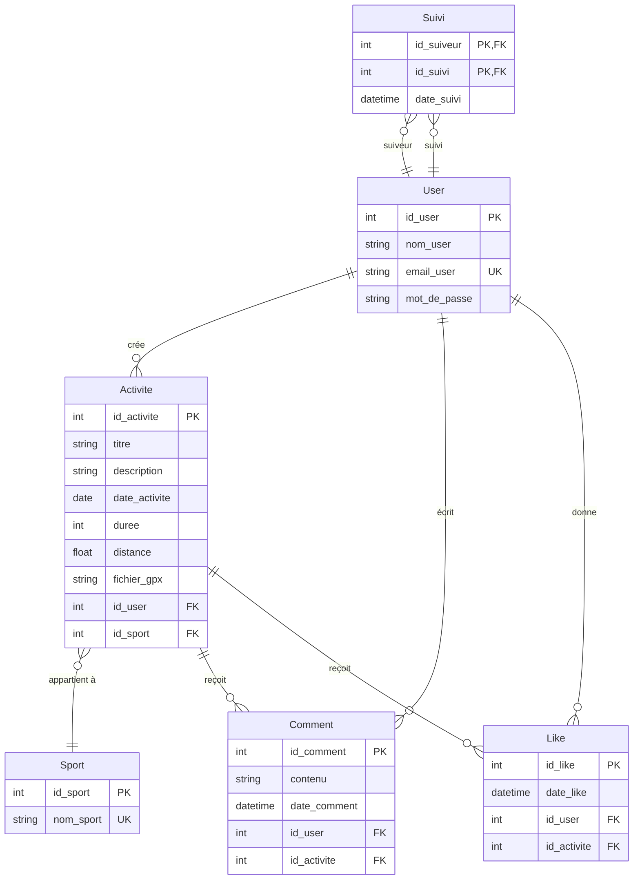

```mermaid
erDiagram
    User {
        int id_user PK
        string nom_user
        string email_user UK
        string mot_de_passe
    }

    Sport {
        int id_sport PK
        string nom_sport UK
    }

    Activite {
        int id_activite PK
        string titre
        string description
        date date_activite
        int duree
        float distance
        string fichier_gpx
        int id_user FK
        int id_sport FK
    }

    Comment {
        int id_comment PK
        string contenu
        datetime date_comment
        int id_user FK
        int id_activite FK
    }

    Like {
        int id_like PK
        datetime date_like
        int id_user FK
        int id_activite FK
    }

    Suivi {
        int id_suiveur PK, FK
        int id_suivi PK, FK
        datetime date_suivi
    }


    %% Relations
    User ||--o{ Activite : "crée"
    User ||--o{ Comment : "écrit"
    User ||--o{ Like : "donne"

    Activite }o--|| Sport : "appartient à"
    Activite ||--o{ Comment : "reçoit"
    Activite ||--o{ Like : "reçoit"

    Suivi }o--|| User : "suiveur"
    Suivi }o--|| User : "suivi"
```
